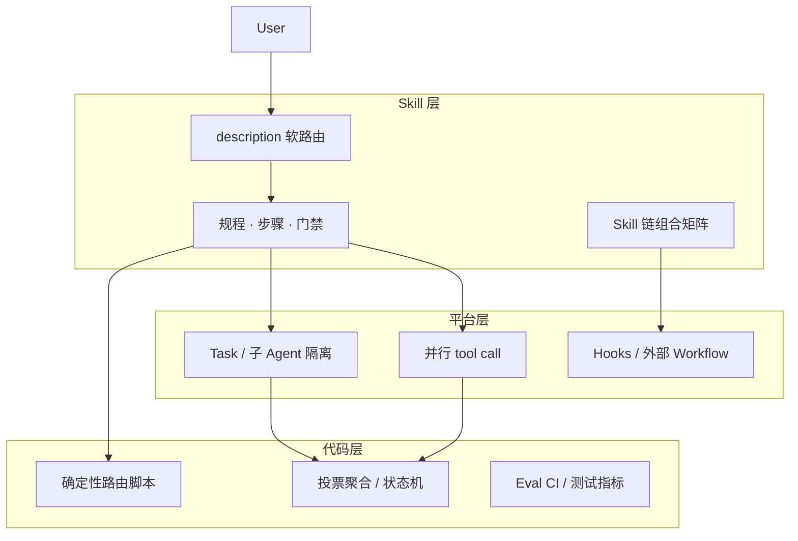

# Agent Design Patterns × Agent Skill

> **五种 Agent Design Patterns 的 Skill 化落地指南与脚手架仓库**


---

## 为什么需要这个仓库？

Agent 框架（LangGraph、Temporal、Agno Workflow）文档常假设你有完整的 Workflow Runtime；而 IDE 中的 Agent Skill（`SKILL.md`）是轻量级规程包——**它擅长"写怎么做"，但不具备运行时语义**。

本仓库系统性地将 Anthropic 与 Google 等提出的 **Prompt Chaining、Routing、Parallelization、Orchestrator-Workers、Evaluator-Optimizer** 五种模式映射到 Skill 的能力边界，回答一个核心问题：

> **哪些部分该写进 Skill？哪些必须交给平台或代码？**

---

## 核心论断

> **Skill 是五种模式的「剧本与门禁」；Task/子 Agent/脚本/Workflow 引擎是「舞台与灯光」。**

五种模式都应使用 Agent Skill 承载策略层与组合层，但 **生产级可靠运行必须叠加平台能力与代码化硬语义**。

---

## 快速开始

### 1 分钟安装

复制任意 Skill 到 Cursor 项目（以 Router 为例）：

```bash
mkdir -p .cursor/skills/task-router
curl -o- https://raw.githubusercontent.com/<YOU>/skill-patterns/main/skills/routing/task-router/SKILL.md \
  > .cursor/skills/task-router/SKILL.md
```

> 将 `<YOU>` 替换为实际 GitHub 用户名；克隆仓库更稳妥（见下方）。

或直接克隆整个 `skills/` 目录：

```bash
git clone --no-checkout <repo-url> /tmp/sp
cd /tmp/sp && git sparse-checkout set skills && mv skills /path/to/your-project/
rm -rf /tmp/sp
```

### 5 分钟验证

在 Cursor 中输入「帮我看下最近 7 天的 Jira 工单」，观察 Agent 是否自动触发 `task-router` Skill（由 `description` 软路由触发）。

### 深入理解

按你的角色选择阅读路径：

| 你是谁 | 从这里开始 |
|--------|-----------|
| 快速评估值不值得用 | [核心论断](#核心论断) + [五种模式适配度](#五种模式适配度) |
| 理解整体架构理论 | [summary.md](./summary.md) |
| 落地部署、安装 Skill | [skills/README.md](./skills/README.md) |
| 系统性学习 | [docs/00-foundation.md](./docs/00-foundation.md) |

---

## 五种模式适配度

> 注：五种模式对应 6 个 Skill，因为 Parallelization 拆为 Parallel Dispatch + Vote Synthesis 两个独立 Skill。

| # | 模式 | 对应 Skill | 适配度 | 一句话总结 |
|---|------|-----------|--------|-----------|
| 1 | **Prompt Chaining** | `delivery-chain` | ⭐⭐⭐⭐⭐ | Skill 主战场——步骤、顺序、门禁天然适合 Markdown 表达 |
| 2 | **Routing** | `task-router` | ⭐⭐⭐⭐⭐ | Router Skill + `description` 软路由，高危场景叠加规则脚本兜底 |
| 3 | **Orchestrator-Workers** | `orchestrator` | ⭐⭐⭐⭐ | meta-skill 描述分派策略 + Task 隔离 Worker |
| 4 | **Evaluator-Optimizer** | `eval-optimize-loop` | ⭐⭐⭐⭐ | Skill rubric + 独立 Critic subagent + Harness 硬评测 |
| 5 | **Parallelization + Voting** | `parallel-dispatch` + `vote-synthesis` | ⭐⭐⭐ | Skill 写并发规程，但真并行和投票聚合必须靠平台+脚本 |

---

## 三层架构



| 层 | 职责 | 能做 ✅ | 不能直接做 ❌ | 示例 |
|----|------|---------|-------------|------|
| **Skill** | 何时用、步骤顺序、门禁、组合策略 | 描述流程、约束行为、渐进披露 | 保证并行、持久化、硬循环上限 | `SKILL.md`、`description` |
| **平台** | Task 生命周期、子 Agent 隔离、并发 | 真并行、只读派发、上下文隔离 | 替代业务逻辑、评判标准 | `task()`、`readonly: true` |
| **代码** | 路由、投票、评测、持久化 | 确定性执行、可回归、可灰度 | 自动理解意图 | `classify.py`、`aggregate_votes.py`、evalset |

---

## 平台兼容性

| 平台 | 支持程度 | 说明 |
|------|---------|------|
| **Cursor** / Agent Mode | ✅ 原生 | `SKILL.md` 直接放 `.cursor/skills/` 即可被自动发现 |
| **Claude Code** | ✅ 原生 | 放在 `.agents/skills/` 或 `~/.claude/skills/` |
| **OpenCode** | ✅ 原生 | `SKILL.md` 按软件包规范放置即可 |
| **Agno** | ✅ 通过 SDK | 使用 `LocalSkills` loader 加载（见 [skills/README.md](./skills/README.md)） |
| **LangChain** | ⚠️ 需适配 | 可转为 `StructuredOutput` + `Runnable` 链 |
| **Dify / Coze** | ⚠️ 需适配 | 工作流节点映射到 Skill 步骤 |

> **通用原则**：只要你的平台支持 `SKILL.md`（YAML frontmatter + Markdown 正文 + `references/` 按需加载），本仓库的脚手架都可直接迁移。

---

## Before vs After

### 没用这个仓库时

```
一个巨型 SKILL.md → 800 行 → description 模糊 → Agent 不确定该不该触发
→ 并行调 Agent 但共享上下文 → 投票结果高度相关
→ 没有评测标准 → 每次"通过看"判断，质量漂移
```

### 按本仓库实践后

```
按 Pattern 拆 6 个独立 Skill → 每个 description 精准 → 路由置信度提高
→ orchestrator Skill 派发 readonly Worker → 结果独立
→ eval-optimize-loop Skill 带 rubric → Critic subagent 按标准给可执行反馈
→ 合并前跑 evalset CI → 可回归可断言
```

---

## 典型场景 × Skill 链

| 场景 | Skill 组合 | 需要额外的平台/代码能力 |
|------|-----------|----------------------|
| 新功能从零交付 | `delivery-chain` → `eval-optimize-loop` | 无（IDE 内闭环） |
| 运维工单自动分流 | `task-router` → `orchestrator` | 规则分类器脚本（可选） |
| 多路并行调查 | `parallel-dispatch` → `vote-synthesis` | Task 并行、聚合脚本 |
| **多任务 Plan → 每步质量门** | `orchestrator` → 每任务 `eval-optimize-loop` | readonly Critic subagent |
| 合并分支前最终检查 | `eval-optimize-loop` → `verification-before-completion` | 构建/测试命令 |

> 端到端 Walkthrough 见 [docs/examples/01-orchestrator-eval-optimize.md](./docs/examples/01-orchestrator-eval-optimize.md)

---

## 设计原则与反模式

### 三条原则

1. **按 Pattern 拆 Skill** — 一个 Skill 一件事，组合靠引用而非堆叠
2. **硬语义外置** — 路由脚本、投票聚合、CI evalset 不写在 SKILL.md 里
3. **Critic 必须独立** — Generator 自评 = 无效门，用 readonly subagent 当裁判

### 反模式（速查）

| 避免 | 风险 | 改做 |
|------|------|------|
| 一个巨型 Skill 包打所有模式 | 难维护、description 模糊 | 按 Pattern 拆分，用组合矩阵串联 |
| Worker / Generator 自评即 pass | 自我偏好、质量漂移 | Task 派发 readonly Critic subagent |
| 无 rubric 的模糊评审 | 不可执行、无从回归 | `critic-feedback-format` 标注具体缺陷位置 |
| 仅靠 `description` 做高风险路由 | 误路由成本高（工单误分、数据误删） | L1 规则脚本兜底 → 低置信度人工确认 |

详见 [docs/06-practices.md](./docs/06-practices.md)。

---

## 如何扩展

### 新增一个 Skill

```bash
mkdir -p skills/<pattern>/<your-skill>/references
cat > skills/<pattern>/<your-skill>/SKILL.md << 'EOF'
---
name: <your-skill-name>
description: <trigger description>
---

# <Your Skill Title>

## 场景

...

## 步骤

1. ...
EOF
```

要求：
- YAML frontmatter 含 `name` 和 `description`（CI 校验字段）
- 指向 `docs/` 中对应模式文档
- 复杂脚本放 `scripts/`，引用模板放 `references/`（渐进披露）

### 修改现有 Skill

所有 Skill 变更需同步更新：
1. `summary.md` 中的索引映射
2. 关联的 docs 文档（版本同步）
3. 如新增脚本，补充 smoke test

---

## 文档导航

### 基础

| 文档 | 内容 | 对应脚手架 |
|------|------|-----------|
| [Agent Skill 基础](./docs/00-foundation.md) | 能力边界、三层架构、Pattern 正交、SkillOps 要求 | — |

### 五种模式（按适配度排序）

| # | 文档 | 一句话 | 对应脚手架 |
|---|------|--------|-----------|
| 1 | [01 - Prompt Chaining](./docs/01-prompt-chaining.md) | Skill 主战场 | [`chaining/delivery-chain`](./skills/chaining/delivery-chain/) |
| 2 | [02 - Routing](./docs/02-routing.md) | Router Skill + 确定性分类器 | [`routing/task-router`](./skills/routing/task-router/) |
| 3 | [03 - Parallelization + Voting](./docs/03-parallelization.md) | Skill 规程 + 平台 + 聚合脚本 | [`parallel/parallel-dispatch`](./skills/parallel/parallel-dispatch/)、[`parallel/vote-synthesis`](./skills/parallel/vote-synthesis/) |
| 4 | [04 - Orchestrator-Workers](./docs/04-orchestrator-workers.md) | meta-skill + Worker + Task | [`orchestration/orchestrator`](./skills/orchestration/orchestrator/) |
| 5 | [05 - Evaluator-Optimizer](./docs/05-evaluator-optimizer.md) | Critic subagent + rubric + Harness | [`evaluation/eval-optimize-loop`](./skills/evaluation/eval-optimize-loop/) |

### 实践与参考

| 文档 | 内容 |
|------|------|
| [06 - 实践建议与反模式](./docs/06-practices.md) | 优先级、目录规划、模式组合速查 |
| [端到端示例](./docs/examples/01-orchestrator-eval-optimize.md) | Plan → 并行 Worker → Critic 循环 → 集成报告 |
| [术语表与延伸阅读](./docs/appendix.md) | 术语对照、版本历史、外部资源 |

> **安装与使用 Skill 脚手架** → [skills/README.md](./skills/README.md)
