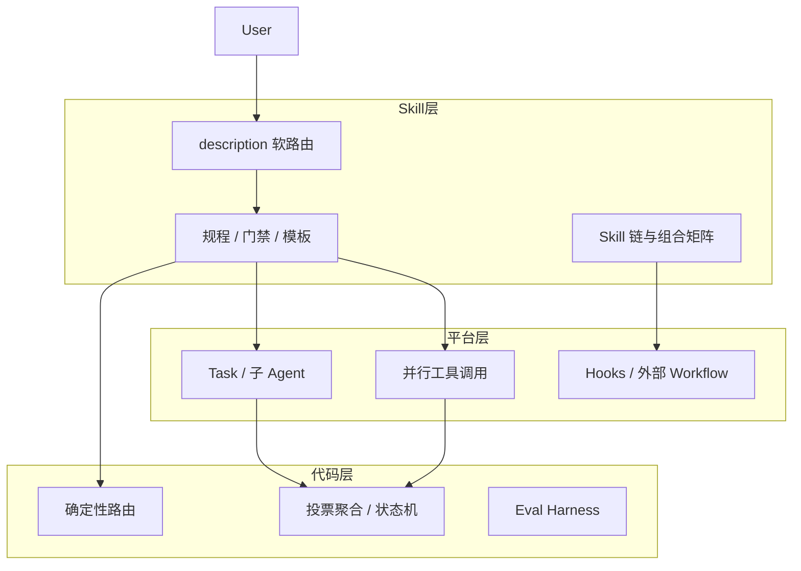

# Agent Skill 基础：能力边界与三层架构

> [← 返回总览](../summary.md)

---

## 定义

**Agent Skill** 是以 `SKILL.md` 为核心的可版本化规程包，通常包含：

- YAML frontmatter（`name`、`description`）
- 分步指令、门禁、输出模板
- 可选的 `references/`、`scripts/`（渐进披露）

## 能力边界

| 维度 | Skill 的能力 | Skill 的边界 |
|------|-------------|-------------|
| 形态 | `SKILL.md` + 可选引用与脚本 | 不是独立进程，不是 Workflow 引擎 |
| 加载 | 渐进式：先 `name`+`description`，再按需读正文 | 不保证 100% 按步骤执行（依赖 LLM 遵从度） |
| 触发 | `description` 决定「何时选用」 | 第一层路由是**软路由**（语义匹配） |
| 编排 | 用 Markdown 写清步骤、门禁、组合其他 Skill | **不能**单独保证真并行、持久状态机、硬循环上限 |
| 与 Tool | Skill 写「怎么做」，Tool 提供「单步能力」 | 原子能力仍靠 MCP/Shell/API |

## 核心论断

> **Skill 是五种模式的「剧本与门禁」；Task/子 Agent/脚本/Workflow 引擎是「舞台与灯光」。**

## 三层架构

### 各层职责

| 层 | 职责 |
|----|------|
| **Skill** | 何时用、步骤顺序、门禁、组合哪些 Skill、输出模板 |
| **平台** | Task 并行、子 Agent 隔离、并行 tool call、Hooks |
| **代码/Eval** | 确定性路由、投票计数、测试/指标、状态持久化 |

## Pattern 与 Skill 的正交关系

- **Pattern** = 控制流拓扑（链、叉、并行、环）
- **Skill** = 可版本化的规程与知识包

同一 Skill 可参与多种 Pattern。例如 `code-reviewer` 既是 Routing 的终点，也是 Evaluator-Optimizer 的一环。

## 与官方 Agent Patterns 文档的关系

Anthropic / Google 等 Pattern 文档常假设有 **Workflow Runtime**（LangGraph、Temporal、Agno Workflow）。

**Cursor Agent Skill** 更接近「Prompt + Procedure 的可复用模块」，在 IDE 场景用 **父 Agent + Skill 链 + Task 子 Agent** 近似 Workflow，适合交互式、人机协同任务；不宜单独替代金融级无人值守流水线。

## SkillOps 要求

规程变更应配套：

- CI 检查 `name` / `description` 规范
- 更新 evalset / 场景契约
- 与 MCP、可观测性（Langfuse 等）对齐

否则 Skill 越多，软编排漂移风险越大。

## 三种说法的对照

| 说法 | 是否成立 |
|------|---------|
| 五种模式都可以用 Skill **描述和驱动** | ✅ 成立 |
| 五种模式都可以**仅用一个 Skill 文件、零平台辅助**完整落地 | ❌ 不成立 |
| Skill 是五种模式的**唯一**实现方式 | ❌ 不成立 |

---

**下一篇**：[01 - Prompt Chaining](./01-prompt-chaining.md)
