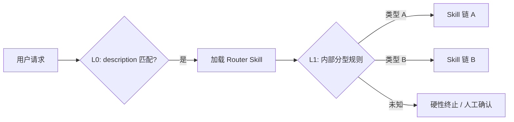

# Pattern 2：Routing（路由）

> [← 返回总览](../summary.md) · 适配度：⭐⭐⭐⭐⭐ · Router Skill + 可选确定性分类器

---

## 原理

根据用户意图、任务类型或上下文，将请求分发到不同的处理路径（不同 Skill 链、不同工具集、不同 Agent 配置）。

## 两层路由模型



| 层级 | 机制 | 特性 |
|------|------|------|
| **L0** | 系统根据各 Skill 的 `description` 决定是否加载 | 软、语义级 |
| **L1** | Router Skill 内评分表、关键词、门禁表 | 可写硬性终止条件 |

## 生态内范例

**`dops-task-router`** 完整流水线：

```text
0. Superpowers 环境预检
1. 获取 Jira 工单
2. 任务分型（8 类 + 关键词评分）
3. L0/L1 Preflight
4. 加载 Superpowers 组合（skills-matrix）
5. 进入领域 Skill
```

硬性门禁示例：

- 无法归类 → **立即终止**，不进入执行链
- Preflight BLOCKER → 写 Jira 备注后终止
- Superpowers 未安装 → 禁止 Step 5

## 推荐实现形态

### 文档结构

```text
routing/
└── task-router/
    ├── SKILL.md
    └── references/
        ├── keyword-scoring.md      # 分型规则
        ├── skills-matrix.md        # 类型 → Skill 组合
        ├── preflight/              # 各类型 Preflight
        └── reject-templates/       # 拒绝输出模板
```

### Router SKILL.md 要点

```markdown
---
name: task-router
description: >-
  Routes incoming tasks by type to the correct skill chain.
  Use when handling support tickets, ops tasks, or multi-type workflows.
---

## 硬性门禁
| 条件 | 动作 |
|------|------|
| 无法归入已知类型 | 终止，说明原因，不调用执行类工具 |
| 低置信度分型 | 请用户从 N 类中选择 |
| Preflight BLOCKER | 按模板输出后终止 |

## 分型流程
1. Read references/keyword-scoring.md
2. 输出分型结果 + 置信度
3. 加载 references/skills-matrix.md 中对应行
4. 按矩阵顺序加载下游 Skill
```

### 确定性分类器（生产补充）

高风险场景在 L1 之外增加脚本：

```text
scripts/classify.py   # 规则 / 轻量模型
hooks/pre-route.sh    # 请求进入 Agent 前分流
```

## 优势

- 路由规则、拒绝条件、输出模板可版本化、可 Code Review
- 「无法归类则终止」适合写成 Skill 硬性门禁
- `skills-matrix.md` 使组合关系一目了然

## 局限与缓解

| 局限 | 缓解 |
|------|------|
| L0 软路由可能误匹配 | description 写清触发词；`disable-model-invocation` 控制自动加载 |
| LLM 分型不稳定 | 关键词评分表 + 低置信度人工确认 |
| 高并发低延迟 | 外置规则引擎 / Hook，Skill 仅作文档与降级路径 |

## 还需什么（除 Skill 外）

- 关键词/规则脚本（确定性 L1）
- Preflight 检查清单（可脚本化部分）

## 结论

**Routing 非常适合 Skill；生产环境建议「Skill 规程 + 确定性分类器」双轨。**

---

**相关文档**：[04 - Orchestrator-Workers](./04-orchestrator-workers.md) · [06 - 实践与反模式](./06-practices.md)
