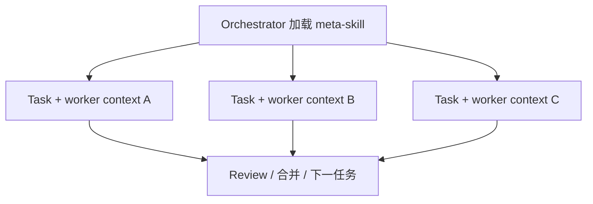

# Pattern 4：Orchestrator-Workers（编排者-工作者）

> [← 返回总览](../summary.md) · 适配度：⭐⭐⭐⭐ · meta-skill + 领域 Worker Skill + Task

---

## 原理

**Orchestrator** 负责理解目标、拆解任务、派工、汇总结果；**Worker** 在窄域内专注执行，上下文隔离，完成后 handoff 回 Orchestrator。



## 角色映射

| 角色 | 对应物 |
|------|--------|
| **Orchestrator** | `subagent-driven-development`、`executing-plans`、`dops-task-router` |
| **Worker** | `code-reviewer`、`systematic-debugging`、`jira-dops-diagnosis` 等领域 Skill |
| **派工机制** | `Task(subagent_type=...)` + 精心构造的 prompt |
| **进度跟踪** | `TodoWrite`、plan 文件 |

## 生态内范例

### subagent-driven-development

每个任务循环：

```text
1. 派发 implementer subagent
2. 派发 spec reviewer subagent
3. 派发 code quality reviewer subagent
4. 通过后标记 TodoWrite 完成 → 下一任务
```

### executing-plans

在独立会话中按 plan 批量执行，适合与 orchestrator 二选一。

## 推荐实现形态

```text
orchestration/
└── orchestrator/
    ├── SKILL.md
    └── references/
        ├── skills-matrix.md       # 任务类型 → Worker Skill
        ├── worker-prompt-template.md
        └── handoff-format.md
```

### orchestrator SKILL.md 要点

```markdown
---
name: orchestrator
description: >-
  Decomposes work into independent tasks and dispatches worker subagents.
  Use when executing multi-task implementation plans.
---

## Orchestrator 职责
1. 读取 plan，提取全部任务全文
2. 创建 TodoWrite 跟踪
3. 按依赖顺序派发 Worker（无依赖可并行）
4. 审查 handoff，合并冲突
5. 全部完成后触发全量 code review

## Worker 派发模板
见 references/worker-prompt-template.md

## 硬性约束
- Worker 不得继承父会话历史
- 每 Worker 单一职责、明确文件边界
- handoff 必须含：摘要、变更范围、风险、验证命令输出
```

### Worker prompt 模板（references/worker-prompt-template.md）

```markdown
## 你的任务
{task_full_text}

## 范围
- 只允许修改：{allowed_paths}
- 禁止修改：{forbidden_paths}

## 目标
{acceptance_criteria}

## 完成后 handoff
按 references/handoff-format.md 输出
```

### handoff 格式（references/handoff-format.md）

```markdown
## 摘要
（1-3 句）

## 变更范围
- 文件列表

## 验证证据
\`\`\`
{command output}
\`\`\`

## 风险与未决
- ...
```

## Skill 应规定的内容

| 项 | 说明 |
|----|------|
| Worker 边界 | 目录、模块、禁止越界 |
| Handoff 格式 | 结构化，便于 Orchestrator 合并 |
| skills-matrix | 任务类型 → 用哪个 Worker Skill |
| 评审策略 | 每任务后评审 vs 全量结束后评审 |

## 与其他 Pattern 的组合

| 组合 | 场景 |
|------|------|
| Orchestrator + **Parallelization** | 无依赖任务并行派发 |
| Orchestrator + **Critic-Generator** | 每 Worker 产出后 `eval-optimize-loop`（独立 Critic） · [端到端示例](./examples/01-orchestrator-eval-optimize.md) |
| Orchestrator + **Routing** | 先路由任务类型，再选 Worker 矩阵行 |

## 局限与缓解

| 局限 | 缓解 |
|------|------|
| 长时编排（小时/跨天） | AgentOS、Temporal、消息队列 |
| 双阶段评审复杂度高 | 拆成 spec / quality 两个 Worker Skill |
| 并行改同一仓库 | `using-git-worktrees` |

## 还需什么（除 Skill 外）

- **子 Agent / Task** 执行层
- **上下文隔离**（不继承父历史）
- **冲突合并**策略（父 Agent 或脚本）
- 可选：**git worktree** 并行开发

## 结论

**适合「1 个 Orchestrator Skill + N 个 Worker Skill」；执行层必须靠子 Agent/Task，Skill 定义拆工与 handoff 契约。**

---

**相关文档**：[03 - Parallelization](./03-parallelization.md) · [05 - Evaluator-Optimizer](./05-evaluator-optimizer.md)
