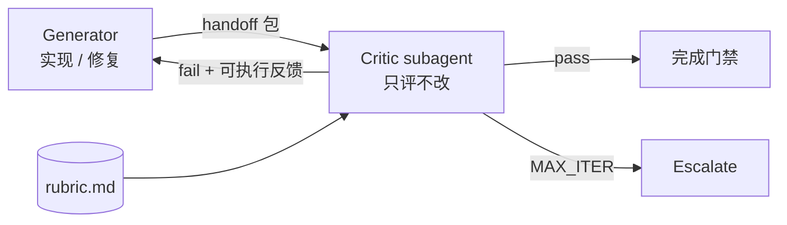

# Pattern 5：Evaluator-Optimizer（Critic-Generator 评估-优化循环）

> [← 返回总览](../summary.md) · 适配度：⭐⭐⭐⭐ · Skill 定义 rubric 与软循环，Harness 做硬评测

---

## 原理

**Critic-Generator** 是工程落地时的首选命名：一个角色**只产出**（Generator），另一个角色**只挑刺、只打分**（Critic），二者隔离，形成闭环。

```text
Generator（生成 / 修复）
  → Critic（对照 rubric 评测，禁止改代码）
  → 不达标？→ Generator 按 Critic 反馈优化 → 再评测
  → 通过或达 MAX_ITER → 结束 / Escalate
```

与 Anthropic **Evaluator-Optimizer**、文献中的 **Critic-Generator** 同构；本仓库 Skill 名仍为 `eval-optimize-loop`。



## 角色映射

| 角色 | 别名 | 职责 | 禁止 |
|------|------|------|------|
| **Generator** | Producer、Implementer | 按 spec 实现；仅根据 Critic 反馈修复 fail 项 | 自评通过、扩大 scope、替 Critic 改 rubric |
| **Critic** | Evaluator、Reviewer | 对照 rubric 逐项评测；输出可执行缺陷清单 | 写业务代码、直接 merge、模糊「还行」 |
| **Harness** | CI / Eval | 确定性测试、lint、evalset 门禁 | — |

## 与 Reflection / Reflexion 的边界

| 维度 | Reflection（狭义） | Reflexion（论文） | 本模式 Critic-Generator |
|------|-------------------|-------------------|-------------------------|
| 评谁 | 常是**同 Agent 自评** | Agent 写反思笔记 | **独立 Critic subagent** |
| 记忆 | 可选，会话内 | **跨 trial 持久反思** | 同任务内多轮；跨任务靠 evalset/日志 |
| 反馈 | 开放式反思 | 环境 reward +  verbal reflection | **rubric + 证据 + rubric ID** |
| 终止 | 不定 | 多 trial | **MAX_ITER + BLOCKER** |

口头可说「带反思的迭代」，但文档与 Skill 应使用 **Critic-Generator / Evaluator-Optimizer**，避免与单 Agent 自省混名。

## 生态内 Skill 映射

| 能力 | 对应 Skill |
|------|-----------|
| 双角色循环规程 | `eval-optimize-loop` |
| 完成前证据门禁 | `verification-before-completion` |
| 代码/规格双 Critic | `subagent-driven-development` |
| 请求/接收评审 | `requesting-code-review` / `receiving-code-review` |
| 企业 Eval 门禁 | Agno `evals/`、`20_self_evolving_agent_blueprint` |

## 推荐实现形态

```text
evaluation/
└── eval-optimize-loop/
    ├── SKILL.md
    └── references/
        ├── rubric.md                  # pass/fail 标准
        ├── max-iterations.md          # 轮次与 escalate
        ├── blocker-conditions.md      # 立即终止条件
        ├── generator-handoff.md       # Generator → Critic 输入包
        ├── critic-prompt-template.md  # Task 派发 Critic 模板
        ├── critic-feedback-format.md  # Critic → Generator 反馈格式
        └── escalate-template.md
```

## Critic 派发协议（平台层）

```text
1. Generator 完成一轮实现 → 按 generator-handoff.md 打包
2. Task 派发 Critic（readonly，隔离 prompt，不继承 Generator 全文历史）
3. Critic 只读 rubric + handoff + 必要文件 diff
4. Critic 输出 critic-feedback-format.md
5. 全 pass → verification-before-completion → 结束
6. fail → Generator 仅修反馈中的 rubric ID / 缺陷项 → 下一轮
```

### subagent_type 选型（Cursor）

| Critic 侧重 | 建议 type |
|------------|-----------|
| 代码质量 / 逻辑 | `code-reviewer` / `quality-reviewer` |
| 安全 | `security-reviewer` |
| 测试充分性 | `test-engineer` |
| 规格对齐 | `generalPurpose` + rubric 强调 spec |

**硬性要求**：`readonly: true`；prompt 中写明「你是 Critic，禁止修改仓库」。

## eval-optimize-loop 要点

见 [skills/evaluation/eval-optimize-loop/SKILL.md](../skills/evaluation/eval-optimize-loop/SKILL.md)。

| 步骤 | 角色 |
|------|------|
| Generate | Generator |
| Evaluate | **Critic subagent**（非 Generator 自评） |
| Optimize | Generator（仅 fail 项） |
| Escalate | 编排者输出模板，请求人工 |

## 与 Orchestrator-Workers 的关系

`subagent-driven-development` = **Orchestrator + 双 Critic**：

```text
Implementer (Generator)
  → Spec Critic (Critic 1)
  → Quality Critic (Critic 2)
  → 不通过 → 回到 Implementer
```

Orchestrator 在每任务或全量结束后挂载 `eval-optimize-loop`，统一 rubric 与 MAX_ITER。

**端到端示例**：[Plan → Orchestrator → Eval-Optimize](./examples/01-orchestrator-eval-optimize.md)（基于本仓库 `plan.md`）。

## 局限与缓解

| 局限 | 缓解 |
|------|------|
| Generator = Critic 自我偏好 | 独立 Critic subagent + readonly |
| Critic 泛泛而谈 | critic-feedback-format：必填 rubric ID、路径、证据 |
| Skill 无法强制 `while` | MAX_ITER + BLOCKER + escalate 模板 |
| LLM 评测不稳定 | Evals-as-Code、确定性测试 |
| 无轨迹可审计 | Langfuse / 结构化评测表 |

## Evals-as-Code（生产必备）

Skill 定义**软规程**；CI / Harness 定义**硬语义**：

```text
evals/
├── scenarios/
├── evalset.json
└── gates.yaml
```

规程变更 → 同步 evalset → CI。

## 还需什么（除 Skill 外）

| 组件 | 用途 |
|------|------|
| **独立 Critic** | Task + readonly subagent |
| **Handoff 包** | Generator 产出最小充分上下文 |
| **验证命令** | 测试、lint、build |
| **Eval Harness** | CI 回归 |
| **可观测性** | 每轮评测表、Critic agent ID |

## 结论

**Critic-Generator 非常适合用 Skill 表达 rubric、角色边界与反馈格式；硬评测、迭代上限、审计必须靠 Harness 与独立 Critic subagent。**

---

**相关文档**：[01 - Prompt Chaining](./01-prompt-chaining.md) · [04 - Orchestrator-Workers](./04-orchestrator-workers.md) · [06 - 实践建议](./06-practices.md)
