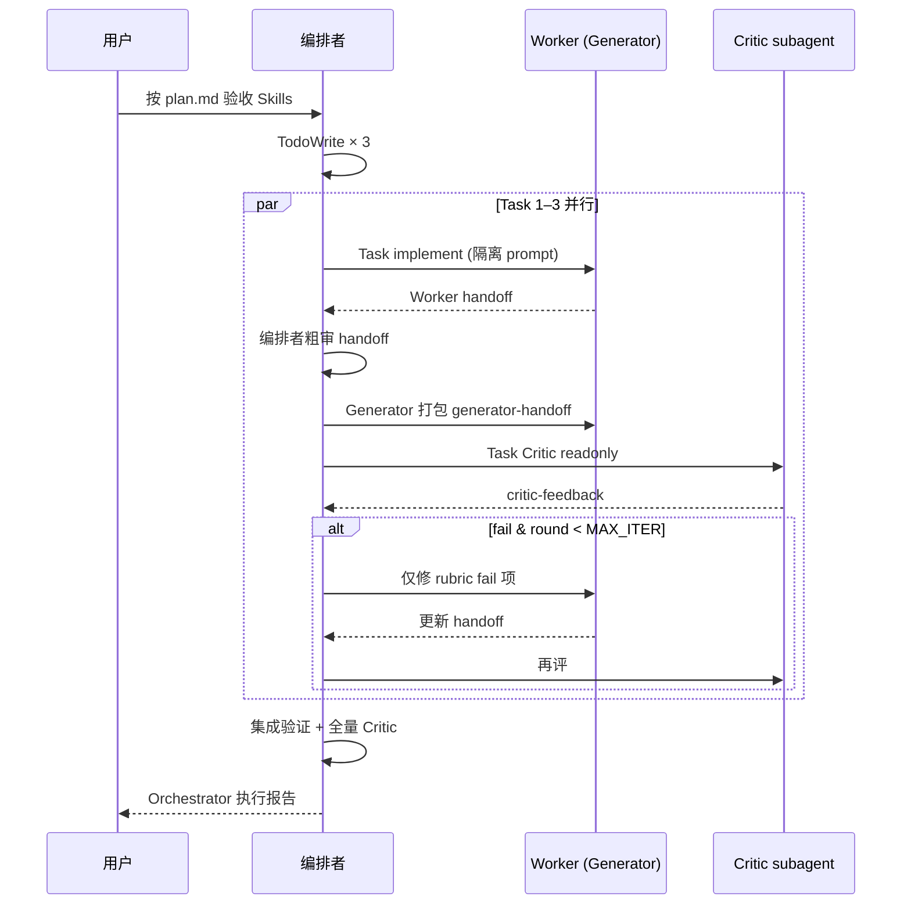

# 端到端示例：Plan → Orchestrator → Eval-Optimize Loop

> 场景：按 `plan.md` 拆工执行，每个 Worker 产出经 **独立 Critic** 门禁，全量结束后再做一次集成评测。  
> 涉及 Skill：`orchestrator` + `eval-optimize-loop`（可选前置 `task-router`）。

---

## 1. 场景与目标

**用户请求**：

> 按 plan 验收本仓库 6 个 Skill 脚手架，修掉能自动修的问题，最后给出报告。

**模式组合**：

| 阶段 | Pattern | Skill |
|------|---------|-------|
| 拆工派发 | Orchestrator-Workers | `orchestrator` |
| 每任务质量门 | Critic-Generator | `eval-optimize-loop` |
| 无依赖并行 | Parallelization | `parallel-dispatch`（可选） |
| 合并前硬门禁 | — | `verification-before-completion`（若已安装） |

本示例使用仓库根目录 [plan.md](../../plan.md)（3 个无依赖任务，可并行）。

---

## 2. 前置条件

```bash
# 安装到项目（示例路径）
cp -r skills/orchestration/orchestrator      .cursor/skills/orchestrator
cp -r skills/evaluation/eval-optimize-loop   .cursor/skills/eval-optimize-loop
cp -r skills/parallel/parallel-dispatch      .cursor/skills/parallel-dispatch  # 可选
```

编排者（父 Agent）开场白：

```text
使用 orchestrator 执行 plan.md；每个 Worker handoff 通过后，
对该任务范围运行 eval-optimize-loop（独立 Critic）。
全部任务与集成评测通过后输出 Orchestrator 执行报告。
```

---

## 3. 总览时序



---

## 4. 阶段 A — Orchestrator 读 plan

### 4.1 提取任务（全文，不摘要）

| ID | 任务 | 允许路径 | 验收 |
|----|------|---------|------|
| T1 | SKILL 结构审计 | `skills/**/SKILL.md` 只读 | 6 个 SKILL 清单 + 缺失项 |
| T2 | 脚本 smoke test | `skills/**/scripts/` | 两脚本 ≥2 用例，有 exit code |
| T3 | 文档交叉引用审计 | `summary.md`, `docs/` 只读 | 断链列表 |

依赖：**无** → 同一轮并行 3 个 Worker Task。

### 4.2 TodoWrite

```text
- [ ] T1 SKILL 结构审计
- [ ] T2 脚本 smoke test
- [ ] T3 文档交叉引用审计
- [ ] 集成验证 + 全量 eval-optimize-loop
```

---

## 5. 阶段 B — 单任务：Worker + Critic（以 T2 为例）

### 5.1 派发 Worker（Generator）

`Task` 参数示意：

```text
description: "T2 script smoke test"
subagent_type: generalPurpose
prompt: |
  ## 你的任务（完整原文）
  Task 2 — 脚本 smoke test
  验收：classify.py 与 aggregate_votes.py 各至少 2 组用例运行成功；记录命令与 exit code。
  范围：skills/routing/task-router/scripts/、skills/parallel/vote-synthesis/scripts/

  ## 验证命令（必须运行并贴出输出）
  python3 skills/routing/task-router/scripts/classify.py --text "fix login 500"
  python3 skills/parallel/vote-synthesis/scripts/aggregate_votes.py --votes '["A","B","A"]'
  …

  ## 完成后必须按 handoff-format 输出
```

### 5.2 Worker 返回 handoff（节选）

```markdown
## Handoff

### 摘要
运行 classify 与 aggregate_votes 各 2 组用例，均 exit 0。

### 变更范围
- （只读任务）无文件变更

### 验证证据
\`\`\`text
$ python3 skills/routing/task-router/scripts/classify.py --text "fix login 500"
exit 0
…
\`\`\`
```

编排者粗审：有证据、未越界 → 进入 **eval-optimize-loop**（不可由 Worker 自评通过）。

### 5.3 组装 generator-handoff → 派发 Critic

```text
Task(
  description="Critic T2 round 1",
  subagent_type="test-engineer",   # 或 code-reviewer
  readonly=true,
  prompt={critic-prompt-template 填入 T2 handoff + rubric}
)
```

### 5.4 Critic 反馈示例 — Round 1 未通过

```markdown
## Critic 评测 — Round 1

| 字段 | 值 |
|------|-----|
| 结论 | 未通过 |
| BLOCKER fail | R1 |

| rubric_id | 项 | 结果 | 证据 |
|-----------|-----|------|------|
| R1 | 测试 | fail | aggregate_votes 仅 1 组用例，plan 要求 ≥2 |
| R2 | 规格 | pass | 与 plan Task 2 对齐 |

| rubric_id | 严重度 | 位置 | 问题 | 建议修复 |
|-----------|--------|------|------|---------|
| R1 | BLOCKER | aggregate_votes.py | 缺第二组用例输出 | 补跑 --votes '["X"]' 并贴 exit code |
```

编排者 → 同一 Worker（或新 Task）**仅修 R1**，禁止扩大范围。

### 5.5 Round 2 — 通过

Critic 结论 `通过` → 编排者标记 Todo **T2 done**。

---

## 6. 阶段 C — 并行三任务

同一消息内并行 3 个 Worker Task（`parallel-dispatch` 规程：隔离 prompt、不共享父历史）。

```text
Round 1 并行:
  Task T1 Worker  →  handoff  →  Critic T1 (round 1..n)
  Task T2 Worker  →  handoff  →  Critic T2
  Task T3 Worker  →  handoff  →  Critic T3
```

**注意**：每个任务的 Critic 循环**独立**计数 MAX_ITER；互不等同轮次。

| 任务 | Critic 轮次 | 结果 |
|------|------------|------|
| T1 | 1 | pass |
| T2 | 2 | pass（R1 补证据后） |
| T3 | 1 | pass |

---

## 7. 阶段 D — 集成评测（全量 eval-optimize-loop）

三任务均 done 后，编排者运行**仓库级**验证并再做一次 Critic：

### 7.1 Generator handoff（集成）

```markdown
## Generator Handoff — Integration

### 任务与 spec
plan.md 全部 Task 1–3 已完成；输出验收报告。

### 变更范围
- （列举本轮所有 Worker 改动文件，若无则注明只读验收）

### 验证证据
\`\`\`text
$ python3 skills/routing/task-router/scripts/classify.py …
$ python3 skills/parallel/vote-synthesis/scripts/aggregate_votes.py …
# 可选：对 docs 跑链接检查脚本
\`\`\`
```

### 7.2 Critic 侧重

| rubric_id | 集成阶段关注点 |
|-----------|----------------|
| R2 | 三份任务产出是否覆盖 plan 全部验收项 |
| R4 | 各 Worker 是否越界改动 |
| R1 | 集成验证命令是否全部 pass |

通过后 → `verification-before-completion` → 输出最终报告。

---

## 8. 编排者最终输出

```markdown
## Orchestrator 执行报告

| 任务 | Worker | Critic 轮次 | 状态 |
|------|--------|------------|------|
| T1 SKILL 审计 | generalPurpose | 1 | done |
| T2 脚本 smoke | generalPurpose | 2 | done |
| T3 文档审计 | explore | 1 | done |
| 集成 | 编排者 + Critic | 1 | pass |

## 集成验证
{commands + output}

## Eval-Optimize 摘要
- 无 BLOCKER escalate
- MAX_ITER 未触顶任务：T2（2/3 轮）

## 交付物
- SKILL 缺失项清单
- 脚本 smoke 记录
- 文档断链列表
```

---

## 9. Escalate 示例（T3 假设 Round 3 仍 fail）

```markdown
> **⛔ Eval-Optimize 未通过 — 已达最大迭代次数（3）**

## 仍失败的 Rubric 项（Critic 最后一轮评测表）
| ID | 项 | Critic 失败原因 | Generator 已尝试修复 |
|----|-----|----------------|---------------------|
| R2 | 规格 | summary.md 指向已删除的 skills/foo | 已改 2 次仍断链 |

## 建议下一步
1. 人工确认 skills/foo 是否应恢复或改索引
2. 拆分 T3 为「修链」与「再审计」两个 plan 任务
```

编排者：**停止**后续任务标记，请求用户决策（见 `escalate-template.md`）。

---

## 10. 检查清单

| # | 检查项 |
|---|--------|
| 1 | plan 任务全文已进入 Worker prompt，非摘要 |
| 2 | Worker handoff 含验证证据 |
| 3 | 每任务 Critic 为独立 Task + `readonly: true` |
| 4 | Generator 未代填 Critic 评测表 |
| 5 | fail 只修 critic-feedback 中的 rubric_id |
| 6 | 并行任务各自 MAX_ITER，不混用轮次 |
| 7 | 集成阶段全量验证 + 全量 Critic |
| 8 | 有 BLOCKER escalate 时不 commit / 不宣称完成 |

---

## 11. 相关文件

| 文件 | 说明 |
|------|------|
| [plan.md](../../plan.md) | 本示例输入 plan |
| [04-orchestrator-workers.md](../04-orchestrator-workers.md) | Orchestrator 模式 |
| [05-evaluator-optimizer.md](../05-evaluator-optimizer.md) | Critic-Generator 模式 |
| `skills/orchestration/orchestrator/references/composition-eval-loop.md` | Orchestrator 侧组合规程 |
| `skills/evaluation/eval-optimize-loop/references/composition-orchestrator.md` | Eval 侧组合规程 |
