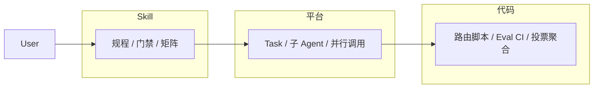

# Agent Design Patterns × Agent Skill 适配分析

> 文档版本：1.1 · 更新日期：2026-05-18  
> 本文档为**总览索引**；各模式详见 [`docs/`](./docs/) 目录。

---

## 摘要

**五种 Agent Design Patterns 均适合用 Agent Skill 承载其「策略层」与「组合层」**，但不宜理解为「仅靠一个 SKILL.md 即可在生产环境完整落地」。

| 结论 | 说明 |
|------|------|
| ✅ 适合用 Skill 表达与驱动 | 规程、门禁、步骤顺序、Skill 组合矩阵、软路由 |
| ❌ 不宜仅靠 Skill 单独实现 | 真并行、确定性路由、投票聚合、硬循环上限、长时持久编排 |
| 推荐架构 | **Skill（剧本与门禁）+ 平台（Task/子 Agent）+ 代码/Eval（硬语义）** |

> **Skill 是五种模式的「剧本与门禁」；Task/子 Agent/脚本/Workflow 引擎是「舞台与灯光」。**

---

## 文档导航

### 基础

| 文档 | 内容 |
|------|------|
| [Agent Skill 基础](./docs/00-foundation.md) | 定义、能力边界、三层架构、正交关系、SkillOps |

### 五种模式（按适配度排序）

| # | 模式 | 适配度 | 文档 | 一句话 |
|---|------|--------|------|--------|
| 1 | **Prompt Chaining** | ⭐⭐⭐⭐⭐ | [01-prompt-chaining.md](./docs/01-prompt-chaining.md) | Skill 主战场 |
| 2 | **Routing** | ⭐⭐⭐⭐⭐ | [02-routing.md](./docs/02-routing.md) | Router Skill + 确定性分类器 |
| 3 | **Parallelization + Voting** | ⭐⭐⭐ | [03-parallelization.md](./docs/03-parallelization.md) | Skill 规程 + 平台 + 聚合脚本 |
| 4 | **Orchestrator-Workers** | ⭐⭐⭐⭐ | [04-orchestrator-workers.md](./docs/04-orchestrator-workers.md) | meta-skill + Worker + Task |
| 5 | **Evaluator-Optimizer (Critic-Generator)** | ⭐⭐⭐⭐ | [05-evaluator-optimizer.md](./docs/05-evaluator-optimizer.md) | Critic subagent + rubric + Harness |

> **更新**: `eval-optimize-loop` Skill 已升级为 **Rubric 工厂模式**（v2.0）：
> - **多行业支持**: 5 个行业（generic/ops/finance/quant/software-dev）
> - **多语言支持**: 4 种语言（Python/Go/TypeScript/Rust）
> - **自进化机制**: 复盘 → 分析 → 优化 → 沉淀
> - **高性能检查**: 所有语言均含性能与内存优化评测项
> - **23 个模板**: 覆盖 Bug修复、API设计、数据库迁移、策略回测等场景（registry 为准）

### 实践

| 文档 | 内容 |
|------|------|
| [实践建议与反模式](./docs/06-practices.md) | 优先级、目录规划、反模式、模式组合 |
| [附录：术语表与延伸阅读](./docs/appendix.md) | 术语、版本历史、外部资源 |
| [示例：Orchestrator + Eval 循环](./docs/examples/01-orchestrator-eval-optimize.md) | Plan 拆工 + 每任务 Critic |

---

## 五种模式总览

| 模式 | 用 Skill 表达 | 单独 Skill 能否完整实现 | 还需什么 |
|------|--------------|------------------------|---------|
| Prompt Chaining | ✅ 极佳 | ⚠️ 软保证 | 步骤门禁、中间产物文件 |
| Routing | ✅ 极佳 | ⚠️ 软路由 | 规则脚本、Router Skill |
| Parallelization + Voting | ✅ 可写规程 | ❌ 不能单独保证 | Task 并行、聚合脚本 |
| Orchestrator-Workers | ✅ 元 Skill + 工 Skill | ⚠️ 部分 | 子 Agent、上下文隔离 |
| Evaluator-Optimizer | ✅ 极佳 | ⚠️ 软循环 | Eval Harness、独立 Evaluator |

---

## 三层架构（简图）



详见 [00-foundation.md](./docs/00-foundation.md)。

---

## 推荐目录结构

```text
patterns/
├── summary.md                 # 本文件（索引）
├── docs/                      # 模式文档
│   ├── 00-foundation.md
│   ├── 01-prompt-chaining.md
│   ├── …
│   └── appendix.md
└── skills/                    # ✅ Skill 脚手架（可安装）
    ├── README.md
    ├── chaining/delivery-chain/
    ├── routing/task-router/
    ├── parallel/{parallel-dispatch,vote-synthesis}/
    ├── orchestration/orchestrator/
    └── evaluation/eval-optimize-loop/
```

安装与使用见 **[skills/README.md](./skills/README.md)**。

---

## 生态内参考 Skill

| Pattern | 范例 |
|---------|------|
| Prompt Chaining | `brainstorming` → `writing-plans` → `executing-plans` |
| Routing | `dops-task-router` |
| Parallelization | `dispatching-parallel-agents` |
| Orchestrator-Workers | `subagent-driven-development` |
| Evaluator-Optimizer | `eval-optimize-loop`、`verification-before-completion` |

---

## 最终结论

**五种 Agent Design Patterns 都应该用 Agent Skill 承载策略层与组合层；生产级可靠运行必须叠加平台能力与代码化硬语义。**

从 [Agent Skill 基础](./docs/00-foundation.md) 开始阅读，或直接进入你关心的模式文档。
